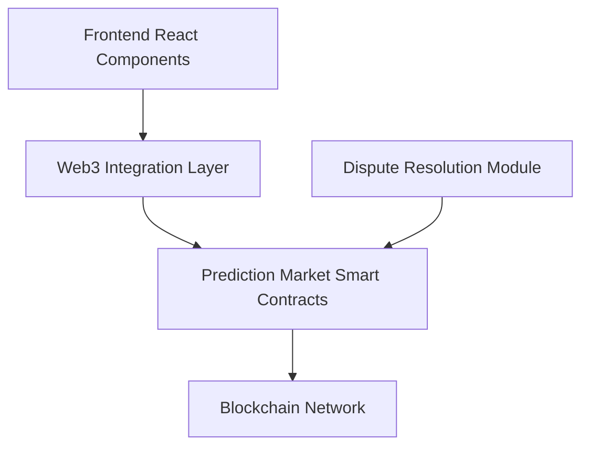

# Architecture

## Components

- **Frontend**: React interface for creating and participating in markets.
- **Web3 Layer**: Connects to smart contracts via ethers.js or web3.js.
- **Smart Contracts**: Handle market creation, participation, and settlement.
- **Dispute Module**: Governance-based dispute resolution.
